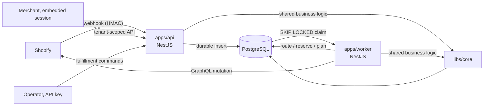

# FulfillFlow

## The business problem

A small print-on-demand or made-to-order seller running their store on
Shopify hits the same wall once order volume passes what one person can
watch by hand: most orders are routine — paid, address complete, stock
available — and should just ship. A handful aren't: an unmapped product
variant, an incomplete address, a stock shortfall, a channel sync failure.
Treating every order the same way means either drowning a human in
noise (checking all of them) or missing the few that actually need a
decision (checking none of them). Off-the-shelf fulfillment apps assume a
warehouse-scale operation with its own ops team; a solo or small-team
seller needs something that runs unattended by default and only interrupts
them for the orders that genuinely can't proceed without a decision.

## Product thesis

**Automate the routine. Escalate the exceptions.**

Every order that *can* be processed automatically — routed to a facility,
stock reserved, ready for production — is, with no human in the loop.
Every order that *can't* — an unmapped SKU, a shortfall, a policy hold —
becomes one queryable, resolvable row (`ExceptionCase`, see ADR-05), not a
silent failure or a buried log line. A merchant's entire relationship with
the day-to-day operation of their store is: nothing, until something needs
their attention, and then exactly the thing that needs it.

## 60-second architecture overview



One modular monolith, two runtime processes sharing one Postgres database
and one shared business-logic package:

- **`apps/api`** — the merchant/operator HTTP surface: Shopify session
  bootstrap, the durable webhook endpoint, tenant-scoped merchant APIs
  (automation rules, overview metrics), and an internal operator command
  API for the fulfillment lifecycle.
- **`apps/worker`** — a headless process that claims and processes two
  Postgres-native queues (`IngestionRecord`, `OutboxEvent`) via
  `SELECT ... FOR UPDATE SKIP LOCKED` — no Redis, no message broker
  (ADR-06). Normalizes Shopify orders, evaluates automation rules, routes
  and reserves inventory, and syncs fulfillment/tracking back to Shopify.
- **`libs/core`** — business logic both apps need identically (routing,
  inventory reservation, the Shopify token manager, the policy engine) —
  see ADR-04 for why this exists as its own package rather than living in
  either app.
- **`libs/db`** — the Prisma schema, migrations, and Postgres-native queue
  primitives both apps and `libs/core` share.

## Golden path

1. A customer places a paid order in the merchant's Shopify store.
2. Shopify delivers `orders/create`. `apps/api` verifies the HMAC over the
   raw body, resolves the store, and durably inserts one `IngestionRecord`
   — no business logic runs in this request.
3. `apps/worker` claims the record, normalizes the Shopify payload,
   validates every line's SKU mapping and the shipping address, evaluates
   any merchant automation rules, and — if nothing blocks it — creates the
   canonical `Order` and routes it to a facility, reserving the inventory
   (or BOM components) it needs.
4. An operator (today: via the internal `/operator/**` command API — see
   ADR-03 for why there's no UI for this in V1) starts production,
   completes it, and ships with a tracking number.
5. Shipping inserts one outbox event; the worker resolves the order's
   Shopify `FulfillmentOrder`, groups allocations by location, and calls
   `fulfillmentCreate` — the Shopify order becomes Fulfilled, with tracking,
   with no human having touched Shopify directly.

## Exception/recovery path

Anything that can't proceed automatically opens one `ExceptionCase`
(ADR-05) instead of failing silently or blocking the whole pipeline:

- **Unmapped SKU** → the order isn't created at all; a merchant maps the
  variant, the stuck ingestion record requeues automatically, and the
  order resumes exactly where it left off.
- **Incomplete/invalid address** → the order *is* created (so nothing else
  about it is delayed) with the address marked invalid; shipping is
  blocked until it's corrected.
- **Insufficient stock** → the fulfillment is created and blocked, not
  silently dropped; reservation retries automatically once stock is
  available.
- **A policy hold** (a merchant-configured automation rule) → the order is
  created but deliberately not routed until the hold is resolved.
- **A Shopify sync failure** (`userErrors`, an unsupported fulfillment-
  service location) → surfaces as one exception instead of retrying
  forever against a mutation that will never succeed.

Every one of these is visible, queryable, and — for the ones a merchant can
act on — resolvable through the merchant API; the ones only an operator can
fix stay internal rather than showing a merchant something they can't do
anything about.

## Shopify integration

- **Managed installation**, not an OAuth redirect flow — the embedded
  app's own App Bridge ID token is verified and exchanged for an
  **expiring offline access token** with refresh-token rotation (ADR-02).
- **Order-management app**, not a fulfillment service — acts only on
  merchant-managed `FulfillmentOrder`s via
  `read_merchant_managed_fulfillment_orders`/
  `write_merchant_managed_fulfillment_orders` (ADR-01).
- **Webhooks**: `orders/create`, `orders/updated`, `orders/cancelled`,
  `fulfillment_orders/order_routing_complete`, `app/uninstalled`, and the
  three mandatory compliance topics (`customers/data_request`,
  `customers/redact`, `shop/redact`) — one canonical HMAC-verified endpoint
  for all of them.
- **Sync-back**: `FulfillmentOrder` line items are resolved lazily and
  cached; a shipment plans its allocations by assigned location, then one
  `fulfillmentCreate` mutation per location group, idempotent against
  retry and against being invoked twice for the same shipment.

## Consistency, idempotency, and concurrency

- **Transactional outbox** (ADR-06): a side effect is only ever queued in
  the same transaction as the business write that requires it — it can
  never be silently lost to a crash between the two.
- **Postgres `SKIP LOCKED` + lease expiry**: a crashed worker never leaves
  a row stuck; a lease simply lapses and another worker reclaims it. No
  `PROCESSING` status exists to get out of sync with reality.
- **Idempotent webhook intake**: unique on Shopify's own delivery id, and
  (as of M7) race-safe under genuinely concurrent redelivery, not just
  sequential — see `docs/benchmarks/benchmark-method.md` for the bug this
  found and fixed.
- **Atomic inventory reservation**: a single guarded SQL `UPDATE` per
  component (`WHERE onHand - reserved >= qty`) means concurrent
  reservations against the same balance serialize on Postgres's own row
  lock rather than racing in application code — proven under 20 concurrent
  reservations against stock of 10 (exactly 10 succeed).
- **Optimistic token rotation**: two concurrent token refreshes never leave
  a torn credential state; the loser re-reads and uses the winner's token.
- **Tenant isolation**: every merchant-facing query/mutation is scoped by a
  server-verified `organizationId`, never a client-supplied one.

## Data handling and security

Full review: `docs/security/data-handling.md` and `threat-model.md`.
Summary: Shopify tokens encrypted at rest (AES-256-GCM); no token ever
logged; HMAC-verified webhook intake with a timing-safe comparison;
tenant-scoped merchant API with cross-tenant access tested explicitly;
automatic PII retention (30-day raw-payload purge) plus full support for
Shopify's own redact/data-request compliance topics; per-tenant rate
limiting on merchant write endpoints.

## Tests and measured benchmarks

`npm test` (real Postgres, `node:test`, no mocked database): **203/203**
across `libs/db`, `libs/core`, `apps/api`, `apps/worker`, run three
consecutive times with zero flakes as this milestone's gate.

Synthetic load benchmarks (method and full numbers:
`docs/benchmarks/latest.md`) — one shared machine, one process, never a
claim of production scale:

- Webhook intake: 500 concurrent requests, **357 req/s, 0% error rate**,
  p50 48ms / p95 77ms.
- Order processing: 300 synthetic orders through the real ingestion loop,
  **71.6 orders/s**, 300/300 accepted.

## Local development setup

```bash
npm ci
# per workspace (libs/db, libs/core, apps/api, apps/worker): create .env.local
# with DATABASE_URL, SHOPIFY_API_KEY/SECRET, SHOPIFY_TOKEN_ENC_KEY (32 bytes,
# base64), OPERATOR_API_KEY (apps/api only) — apps/api/.env.example is the
# only tracked .env.example; the same vars apply in the other three
# workspaces, minus OPERATOR_API_KEY
npm run db:migrate:deploy -w @fulfillflow/db
npm run build
npm test
```

`scripts/db-fresh-local.sh` resets a local dev database from scratch.
`libs/db/prisma/scripts/seed-v2.ts` (`npm run db:seed -w @fulfillflow/db`)
loads synthetic demo data — no real customer or company data exists
anywhere in this repo.

## Trade-offs and V1 limitations

- **No embedded merchant UI** (ADR-03) — a deliberate scope decision made
  in M3, not an oversight. Everything merchant-facing is API-only; a UI is
  additive whenever that decision is revisited.
- **Single-facility routing** (ADR-08) — one order routes to exactly one
  facility; multi-facility split-shipment is out of scope.
- **Merchant-managed fulfillment only** (ADR-01) — no fulfillment-service
  registration, no inventory-sync-to-Shopify, no returns, no Billing API.
- **One Railway replica assumed** — the per-tenant write rate limiter is
  in-memory, correct for V1's single-instance deployment target, not for a
  future multi-replica API without a shared store behind it.
- **The live Shopify dev-store closed loop has not been run** — Gate M5's
  Human Setup Gate H0 (a real Shopify dev store + API credentials) is an
  external, human action this codebase's automated tests can't substitute
  for. Everything the automated suite covers is real and passing; the
  final "does this actually work against real Shopify infrastructure"
  step is still owed.
