# Hướng dẫn quản trị viên: Tạo sản phẩm & vận hành sản xuất

> Dành cho **quản trị viên (ADMIN)** và **nhân viên kho** của GWPrintz.
> Tài liệu gồm hai phần: **Phần A — Dựng danh mục sản phẩm** (tạo sản phẩm, biến thể, SKU, giá, mockup) và **Phần B — Vận hành sản xuất** (đẩy đơn qua xưởng: nhận đơn → in → làm → chụp bằng chứng → giao).
> Ảnh chụp dùng giao diện **tiếng Anh** (mặc định); phần chữ giải thích bằng tiếng Việt. Nút hiển thị đúng như phần **[trong ngoặc]** khi bạn chuyển ngôn ngữ sang tiếng Việt.

**Mục lục**

**Phần A — Dựng danh mục sản phẩm**
1. [Vào khu quản trị](#1-vào-khu-quản-trị)
2. [Tạo sản phẩm gốc](#2-tạo-sản-phẩm-gốc)
3. [Sửa / xuất bản / xoá sản phẩm](#3-sửa--xuất-bản--xoá-sản-phẩm)
4. [Tạo biến thể (Variant)](#4-tạo-biến-thể-variant)
5. [Gắn biến thể → tạo SKU bán được](#5-gắn-biến-thể--tạo-sku-bán-được)
6. [Đặt giá theo hạng (tier) cho SKU](#6-đặt-giá-theo-hạng-tier-cho-sku)
7. [Đặt giá hàng loạt](#7-đặt-giá-hàng-loạt)
8. [Tạo mockup (file in)](#8-tạo-mockup-file-in)
9. [Checklist: để sản phẩm hiện ra cho người bán](#9-checklist-để-sản-phẩm-hiện-ra-cho-người-bán)

**Phần B — Vận hành sản xuất**
10. [Vòng đời một đơn (sơ đồ trạng thái)](#10-vòng-đời-một-đơn-sơ-đồ-trạng-thái)
11. [Nhận đơn về kho (Assign)](#11-nhận-đơn-về-kho-assign)
12. [In tem QR/barcode](#12-in-tem-qrbarcode)
13. [Gắn thiết kế & mockup cho đơn](#13-gắn-thiết-kế--mockup-cho-đơn)
14. [Trạm quét (Scan station)](#14-trạm-quét-scan-station)
15. [Quét nhanh (Quick scan)](#15-quét-nhanh-quick-scan)
16. [Bảng theo dõi xưởng (Monitor)](#16-bảng-theo-dõi-xưởng-monitor)
17. [Các thao tác hàng loạt trên bảng đơn](#17-các-thao-tác-hàng-loạt-trên-bảng-đơn)

---

# Phần A — Dựng danh mục sản phẩm

Chuỗi dựng danh mục đi theo thứ tự: **Sản phẩm → Biến thể → Gắn thành SKU → Đặt giá → (Mockup)**. Bỏ sót một mắt xích thì sản phẩm sẽ **không hiện ra** cho người bán mà không có cảnh báo nào. Xem [checklist](#9-checklist-để-sản-phẩm-hiện-ra-cho-người-bán) ở cuối Phần A.

> **Quyền:** toàn bộ Phần A yêu cầu quyền `products.manage` — trên thực tế là vai trò **ADMIN**. Vai trò khác sẽ thấy trang 403. Riêng **mockup** dùng quyền `mockups.manage` (ADMIN, WAREHOUSE_ADMIN, SUPPORT).

## 1. Vào khu quản trị

Trên thanh menu trên cùng, bấm **Workspace ▾** *(Vận hành)* → dưới nhóm **Administration** *(Quản trị)* (đây là **nhãn nhóm**, không phải nút) bấm **Products** *(Sản phẩm)*. Hoặc vào thẳng `/admin/products`.

Trang **Products** hiện dải tab quản trị: **Users · Products · Variants · Mockups · Materials · BOMs · Transactions · Vendors · Expenses · Warehouses · Audit Log**.

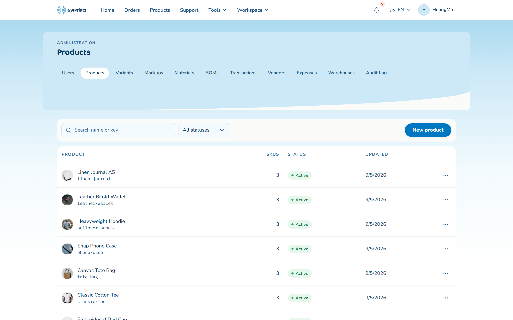

## 2. Tạo sản phẩm gốc

Bước này chỉ tạo **bản ghi sản phẩm** — chưa có SKU bán được và chưa có giá.

1. Ở `/admin/products`, bấm **New product** *(Sản phẩm mới)* ở góc phải thanh công cụ.

   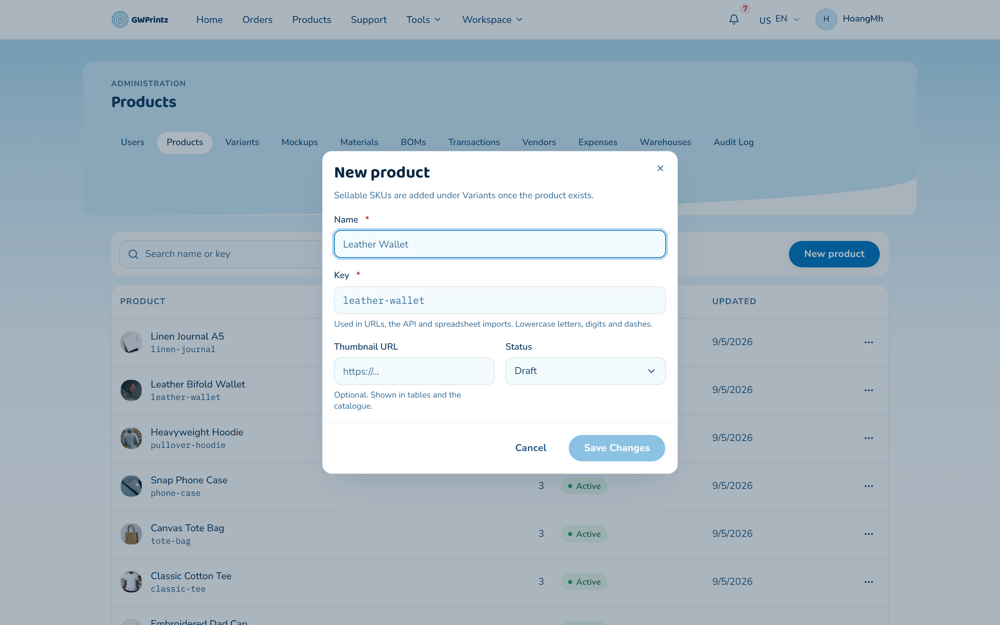

2. Gõ **Name** *(Tên — bắt buộc)*. Khi gõ, trường **Key** *(Khoá)* tự tạo slug (chữ thường, ký tự đặc biệt → dấu gạch ngang).

   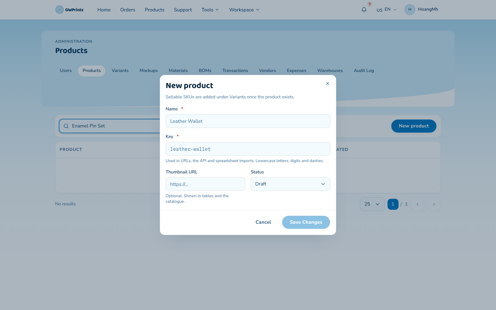

3. Tuỳ chọn sửa **Key** *(dùng trong URL, API và file nhập; chỉ chữ thường, số, dấu gạch ngang; phải là duy nhất)*.
4. Tuỳ chọn dán **Thumbnail URL** *(link ảnh thu nhỏ)*.
5. Tuỳ chọn đổi **Status** *(Trạng thái: Draft / Active / Inactive / Archived)*. Mặc định là **Draft** *(Nháp)*.
6. Bấm **Save Changes** *(Lưu)* — nút chỉ bật khi cả Name và Key đều có giá trị.

> **Ý nghĩa Status:** **Draft** = chưa xuất bản · **Active** = hiển thị trong danh mục và API · **Inactive** = ẩn nhưng còn nguyên · **Archived** = đã ngừng. Chỉ sản phẩm **Active** mới hiện trong danh mục người bán, nên thường để Draft cho tới khi đặt giá xong.

## 3. Sửa / xuất bản / xoá sản phẩm

Bấm nút **⋯** ở cuối mỗi dòng sản phẩm để mở menu:

- **Manage variants** *(Quản lý biến thể)* — mở lưới SKU của sản phẩm.
- **Edit** *(Sửa)* — mở lại hộp thoại để sửa.
- **Deactivate / Activate** *(Ngừng bán / Kích hoạt)* — xuất bản hoặc gỡ khỏi danh mục.
- **Delete product** *(Xoá sản phẩm)*.

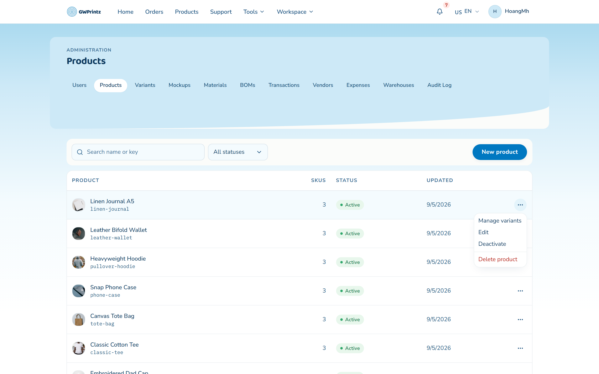

## 4. Tạo biến thể (Variant)

**Biến thể** là giá trị dùng chung như "Black", "Large" — **không** gắn riêng với sản phẩm nào cho tới khi bạn gắn nó vào một sản phẩm.

1. Mở tab **Variants** *(Biến thể)*.

   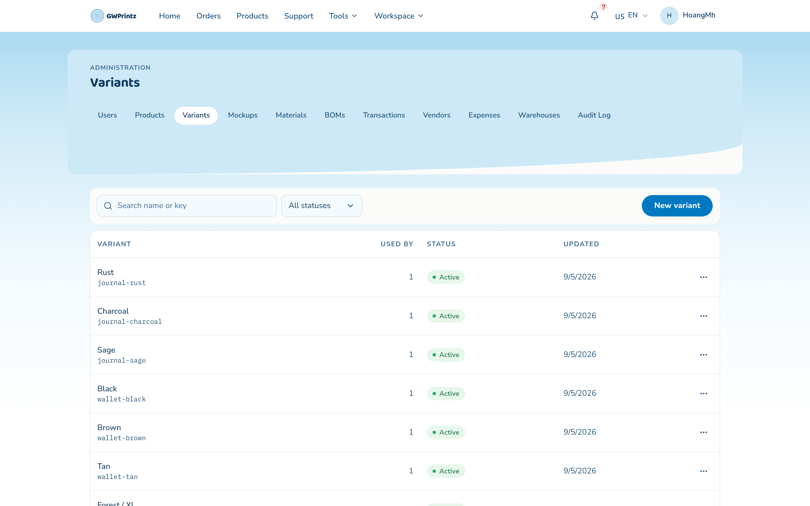

2. Bấm **New variant** *(Biến thể mới)*, điền thông tin và lưu (để **Status = Active** để có thể gắn được).

   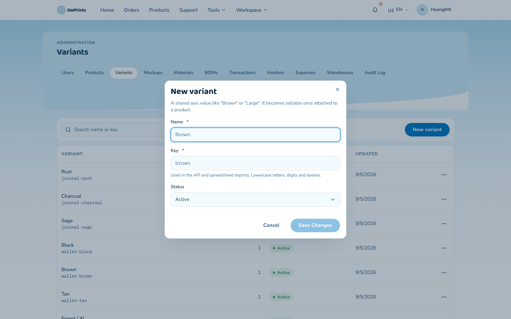

## 5. Gắn biến thể → tạo SKU bán được

Đây là bước biến **Sản phẩm × Biến thể** thành **SKU** mà người bán thực sự đặt.

1. Từ `/admin/products`, bấm số ở cột **SKUS** của dòng (là một link) **hoặc** menu ⋯ → **Manage variants**. Trang lưới SKU mở ra.

   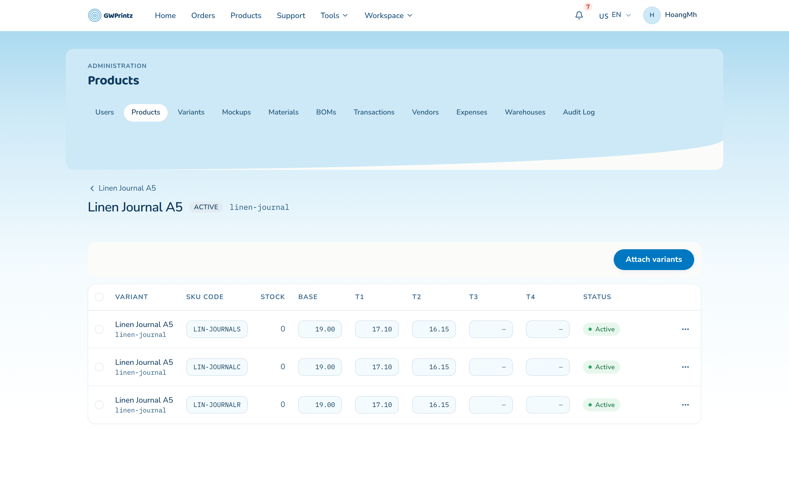

2. Bấm **Attach variants** *(Gắn biến thể)* ở góc phải thanh công cụ lưới.
3. Tích một hoặc nhiều biến thể trong danh sách (bấm bất kỳ đâu trên dòng đều chọn được).
4. Bấm **Attach** *(Gắn)*.

   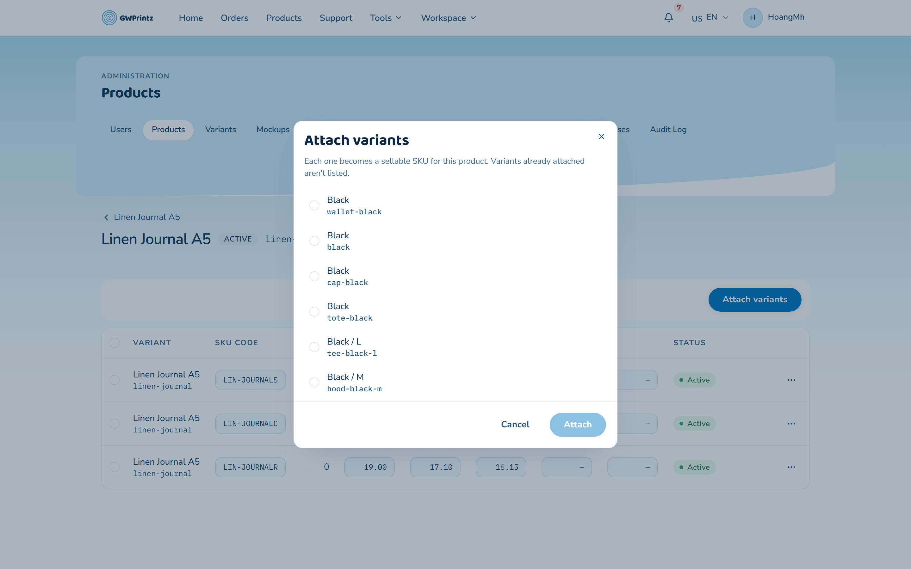

> SKU mới tạo ra ở trạng thái **Active**, tồn kho 0, **chưa có giá**. Bước tiếp theo là đặt giá.
> Nút **Attach variants** bị **vô hiệu** nếu không còn biến thể Active nào chưa gắn.

## 6. Đặt giá theo hạng (tier) cho SKU

Đây là màn hình đặt giá **duy nhất** trong hệ thống. Mỗi SKU có **Base** (tier 0 — giá công khai, bắt buộc) và tuỳ chọn **T1–T4** ứng với `User.tier` của người bán.

1. Tìm dòng SKU trong lưới. Cột từ trái sang phải: *(ô chọn) · Variant · SKU CODE · STOCK · BASE · T1 · T2 · T3 · T4 · STATUS · (Save) · ⋯*.
2. Gõ giá gốc vào ô **BASE** (placeholder 0.00). Các ô **T1–T4** có thể để trống.
3. Nút **Save** xanh xuất hiện ở dòng đó ngay khi có thay đổi — bấm nó, hoặc nhấn Enter trong ô giá bất kỳ của dòng.

> **Cách giá được tính:** hệ thống lấy giá theo tier của người mua, nếu tier đó trống thì quay về **Base**. **Để trống một tier đã có giá đồng nghĩa xoá tier đó khi lưu.**
> ⚠️ Nếu gõ sai định dạng (không phải kiểu `12.50`, có chữ hoặc dấu lạ), việc lưu **thất bại âm thầm** — không hiện lỗi. Kiểm tra lại từng ô.
> ⚠️ Cột đầu ("Variant") của lưới hiện đang in **tên sản phẩm** trên mọi dòng (giống nhau) — phân biệt các SKU bằng cột **SKU CODE**.

## 7. Đặt giá hàng loạt

Áp **một bảng giá giống nhau** cho nhiều SKU cùng lúc.

1. Tích ô chọn ở đầu các dòng SKU muốn đặt giá (hoặc ô chọn ở tiêu đề để chọn tất cả trên trang).
2. Bấm nút **Set prices** *(Đặt giá)* xuất hiện bên trái nút **Attach variants** — nhãn có kèm số lượng, ví dụ **Set prices (3)**.
3. Điền **Base** *(bắt buộc)*, rồi **Tier 1 … Tier 4**.
4. Đọc cảnh báo bên dưới rồi bấm **Apply to all** *(Áp cho tất cả)*.

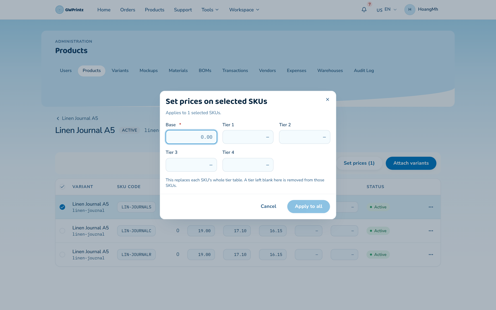

> ⚠️ Thao tác này **thay thế toàn bộ** bảng tier của mỗi SKU đã chọn (không phải cộng gộp). Tier để trống ở đây sẽ **bị xoá** khỏi các SKU đó.

## 8. Tạo mockup (file in)

**Mockup** là file thiết kế/sản xuất mà một **đơn** sẽ được in ra. Mockup gắn với **đơn hàng**, không gắn với sản phẩm.

1. Mở tab **Mockups**.

   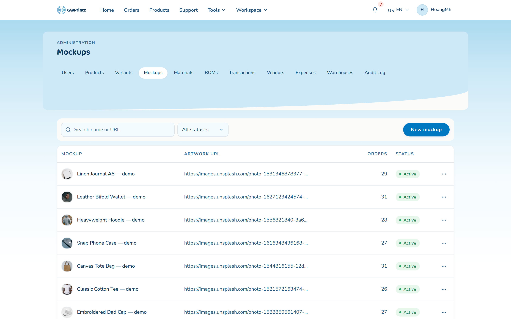

2. Bấm **New mockup** *(Mockup mới)*.
3. Điền **Name** *(Tên — bắt buộc)*. Ở đây **không** có auto-slug.
4. Dán **Artwork URL** *(link file in — bắt buộc; kho sẽ mở link này khi in)*.
5. Tuỳ chọn: **Thumbnail URL** (ảnh xem trước), **Folder ID** (id thư mục nguồn), **Status** *(active / inactive)*.
6. Bấm **Save Changes** — nút bật khi có cả Name và Artwork URL.

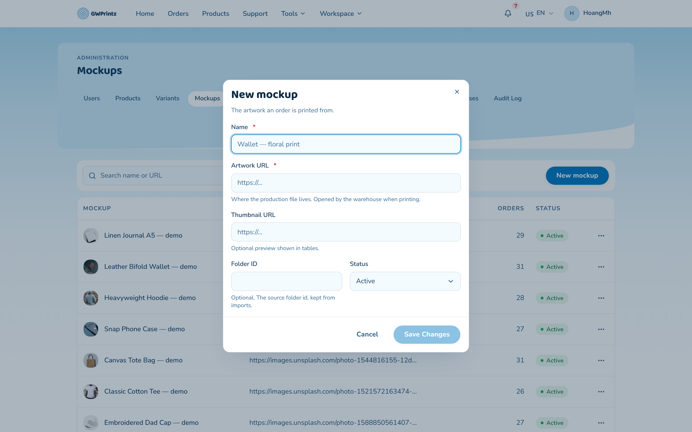

> Hộp thoại này **không có công cụ tải file** — bạn cần có sẵn URL nơi lưu file in (link Drive hoặc tương đương).

## 9. Checklist: để sản phẩm hiện ra cho người bán

Tất cả điều kiện dưới đây phải **cùng đúng** — thiếu một là sản phẩm âm thầm không hiện, không cảnh báo:

1. **Sản phẩm** có **Status = Active**.
2. Có ít nhất **một biến thể Active**.
3. Đã **gắn biến thể** đó vào sản phẩm (tạo SKU), và **SKU cũng Active**.
4. **SKU có giá Base** (tier 0) và đã **Save** — **đây là bước hay bị quên nhất**. SKU chưa có giá bị lọc khỏi danh mục để tránh bán giá 0.
5. Đăng nhập bằng tài khoản người bán, mở **Products → Catalogue**: thẻ sản phẩm xuất hiện với giá "from …" theo tier của người xem.

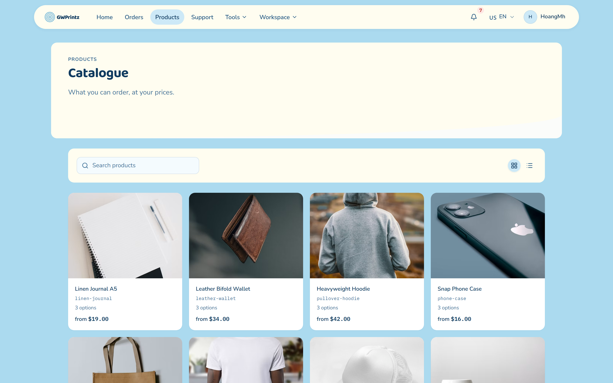

> Nếu vẫn không hiện: kiểm tra **danh sách sản phẩm được phép** của tài khoản đó (allow-list). Nếu tài khoản có bất kỳ dòng allow-list nào, họ **chỉ** thấy những sản phẩm trong đó. Không có công cụ giao diện cho phần này — dữ liệu đến từ đợt chuyển dữ liệu cũ hoặc trực tiếp trong cơ sở dữ liệu.

---

# Phần B — Vận hành sản xuất

## 10. Vòng đời một đơn (sơ đồ trạng thái)

```
PENDING ──assign──► ASSIGNED ──scan──► IN_PRODUCTION ──proof photo──► FULFILLED ──handoff──► SHIPPED ──► DELIVERED
   │                    │                    │                             │                    │
   └──────────── ON_HOLD (tạm giữ, quay lại được) ─────────────┘          │                    │
   └──────────────────────────── CANCELLED (huỷ) ◄──────────────────────────┴────────────────────┘
```

| Trạng thái | Nhãn | Ai/việc gì đưa vào | Tác dụng phụ |
|---|---|---|---|
| **PENDING** | Pending | Tạo đơn (UI, CSV, API) | Chưa trừ tiền, chưa định tuyến. Chỉ ở đây mới sửa được số lượng/thiết kế. |
| **ASSIGNED** | Assigned | **Assign** ở `/orders` (ADMIN/WAREHOUSE_ADMIN) | **Trừ tiền người bán**, gắn kho, giữ tồn kho, báo nhân viên kho. |
| **IN_PRODUCTION** | In production | **Quét** kiện ở trạm | Ghi người quét; tiêu hao vật tư (nếu bật cờ). Chỉ ở đây mới nhập được số lượng đã làm. |
| **FULFILLED** | Fulfilled | **Ảnh chụp đóng gói** (proof) | Ảnh chính là dấu hoàn tất; trả lại chỗ để trong giỏ. |
| **SHIPPED** | Shipped | **Bàn giao** ở trạm (gõ "completed") | Luôn tạo bản ghi vận đơn + tracking; báo người bán. |
| **DELIVERED** | Delivered | Người thao tác chọn tay | Trạng thái **kết thúc**. Tracking hãng vận chuyển không tự đổi. |
| **ON_HOLD** | On hold | Menu trạng thái | Nhớ trạng thái trước để quay lại đúng chỗ. Nằm trong nhóm "Needs attention". |
| **CANCELLED** | Cancelled | Menu / hoàn tiền | Kết thúc. Trả lại tồn kho; báo người bán. |
| **REFUNDED** | Refunded | *(chỉ dữ liệu cũ)* | Không thể tới từ trong app đang chạy. |

## 11. Nhận đơn về kho (Assign)

Đây là màn hình **duy nhất tiêu tiền của người bán**: trừ số dư từng người bán, gắn kho, giữ tồn kho, báo nhân viên kho.

1. Mở **Orders**.
2. Lọc về đơn chờ — bấm thẻ **Pending** trong dải (đặt `?status=PENDING`) hoặc dùng dropdown trạng thái.
3. Tích ô chọn các đơn cần nhận. Một thanh thao tác hàng loạt hiện ra.

   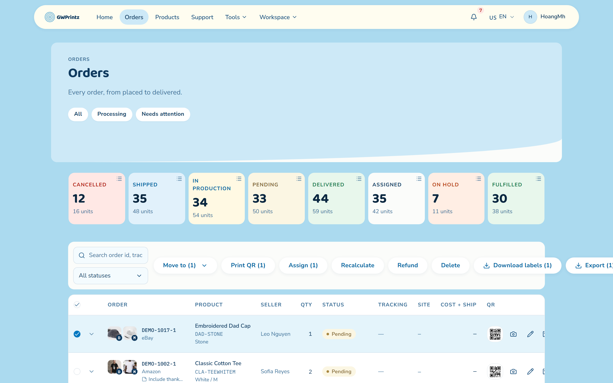

4. Bấm **Assign** *(Nhận đơn)*.
5. Chọn kho ở **Warehouse** *(Kho — bắt buộc)*. Nếu chỉ có một kho, nó được chọn sẵn.
6. Đọc bảng **Charges** *(Phí)*: tên người bán, số đơn, số tiền trừ, **số dư trước → số dư sau**.
7. Bấm **Assign and charge** *(Nhận & trừ tiền)*.

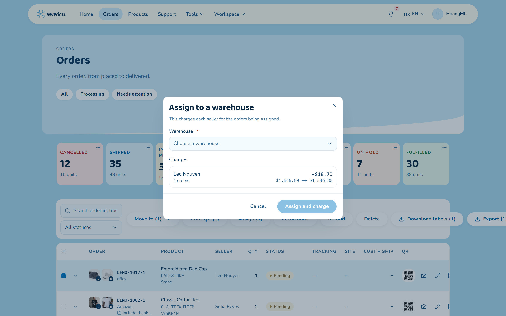

> Nút xác nhận chỉ bật khi: đã chọn kho **và** bảng phí đã tải xong **và** không người bán nào bị đánh dấu thiếu số dư. Nếu có người bán không đủ tiền, họ cần **nạp ví** trước ([Phần 7 của hướng dẫn người bán](nguoi-dung-dat-va-theo-doi-don.md#7-nạp-tiền-vào-ví)).

## 12. In tem QR/barcode

Dán mã quét được lên mỗi kiện để bàn đóng gói tìm ra (ở chế độ Order ID). Cả QR và barcode đều mã hoá **mã đơn**.

1. Ở `/orders`, tích các dòng cần in.
2. Bấm **Print QR** *(In QR)*. Một trang in mở ra, mỗi đơn một thẻ gồm QR + barcode + SKU + địa chỉ.

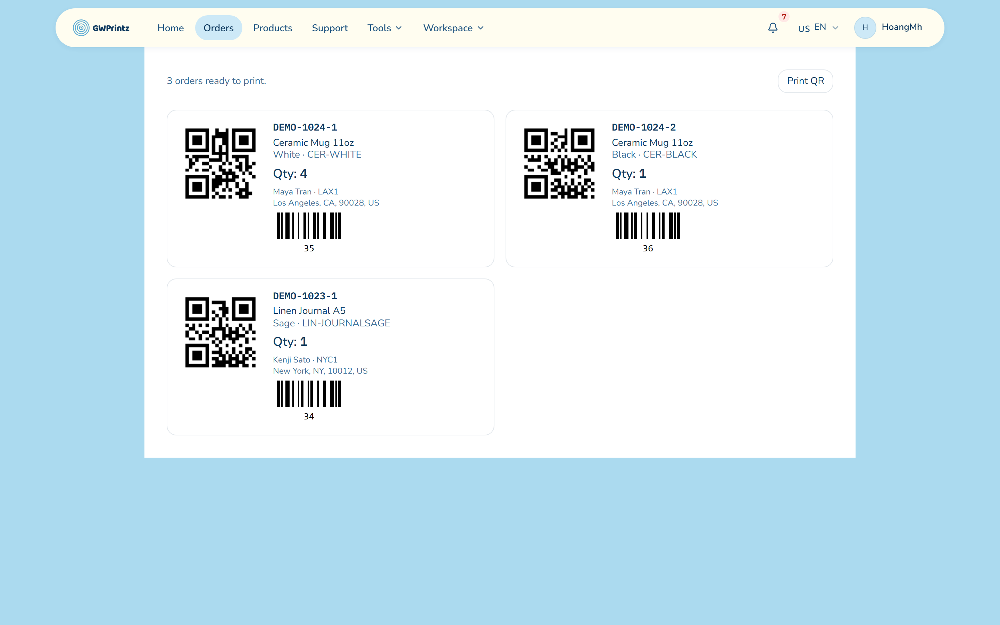

## 13. Gắn thiết kế & mockup cho đơn

Sửa "đơn này in nhầm hình". Chỉ làm được khi đơn còn **Pending**.

1. Ở dòng đơn **Pending**, bấm **biểu tượng ảnh** ở cột thao tác (nhãn: **Design & mockup**).
2. Ô **Design**: dán URL hoặc bấm **Upload image** chọn file (file tải lên được ưu tiên).
3. Ô **Mockup**: tương tự.
4. Bấm **Save**.


## 14. Trạm quét (Scan station)

Tìm kiện và **bắt đầu sản xuất** — tìm và bắt đầu là **một thao tác**, không có nút "bắt đầu" riêng. Mọi đơn ASSIGNED trong kiện chuyển sang IN_PRODUCTION và người quét được ghi nhận.

1. Mở **Fulfillment → Station** *(Trạm)*.

   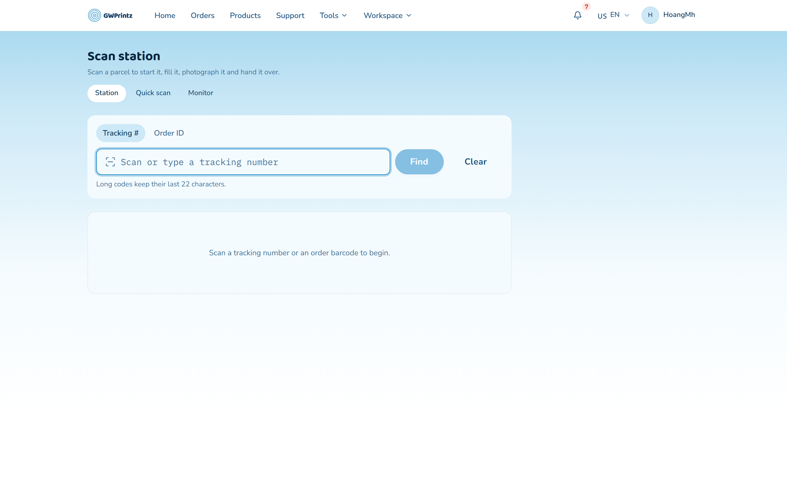

2. Chọn chế độ tìm bằng 2 nút phía trên ô: **Tracking #** *(Mã vận đơn)* hoặc **Order ID** *(Mã đơn)*.
3. Quét barcode bằng súng (hoặc gõ mã) rồi nhấn Enter / bấm **Find** *(Tìm)*.
4. Nếu khớp **hơn 20 đơn**, một cửa xác nhận hiện ra trước — chưa có gì bị đổi; đọc số lượng rồi huỷ hoặc xác nhận.
5. Nếu một phần kiện đã qua ASSIGNED, một cảnh báo thứ hai liệt kê chúng — cân nhắc có phải người khác đang đóng gói kiện này không.
6. Đọc tóm tắt kiện: mã vận đơn (có nút sao chép), người bán, vị trí giỏ, "Open label" nếu có, ảnh proof nếu có.

**Trên card đơn, các bước tiếp theo tại trạm:**

- **Fill** *(Ghi nhận)* — nhập số lượng đã làm vào ô số bên trái nút **Fill** (mặc định là phần còn lại), rồi bấm Fill. Lặp tới khi card hiện huy hiệu xanh **Filled** *(Đã đủ)*. Kiện nhiều đơn sẽ chiếm một chỗ trên kệ ở lần fill đầu.
- **Proof photo** *(Ảnh đóng gói)* — chụp ảnh **kiện đã đóng**: trên điện thoại/tablet bấm **Proof photo** (mở camera sau); trên máy bàn có webcam bấm **Capture photo** hoặc nhấn **phím Space**. Chụp xong → đơn thành **FULFILLED**.
- **Complete handoff** *(Hoàn tất bàn giao)* — bấm nút xanh, nếu chưa có tracking thì gõ số trên kiện, gõ chữ **completed** vào ô xác nhận, rồi bấm **Hand it over** *(Bàn giao)*. Đơn thành **SHIPPED**; nếu có nhãn thì tự mở tab in.

## 15. Quét nhanh (Quick scan)

Bàn phân loại (không phải bàn đóng gói): đẩy một loạt kiện về **một trạng thái** nhanh nhất có thể. Không có ô nhập số lượng, không chụp ảnh.

1. Mở **Fulfillment → Quick scan** *(Quét nhanh)*.
2. Chọn trạng thái áp dụng ở **New status** *(Trạng thái mới)* — mặc định **In production**.
3. Tuỳ chọn gõ **Note** *(Ghi chú)* ghi vào mọi lần đổi trạng thái.
4. Quét barcode vào ô **Tracking #** và nhấn Enter / **Apply** *(Áp dụng)*.
5. Theo dõi 3 ô đếm và bảng log.

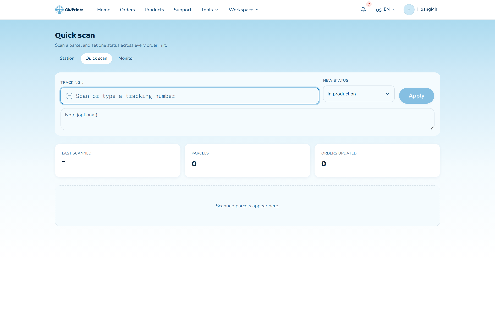

## 16. Bảng theo dõi xưởng (Monitor)

Xem mọi kiện đang chạy mà không có nguy cơ làm đổi trạng thái. Mỗi dòng là một **kiện** (parcel).

1. Mở **Fulfillment → Monitor** *(Bảng theo dõi)*.
2. Chọn bộ lọc **Open / Ready / All** *(Đang mở / Sẵn sàng / Tất cả)* — đây là link, đánh dấu trang được.
3. Đọc dòng: **Tracking · Seller · Orders · Progress** (thanh + đã làm/tổng) **· Statuses · Basket · Label · Oldest**.
4. Bấm **Load more** *(Tải thêm)* để xem tiếp (50 nhóm/lần).

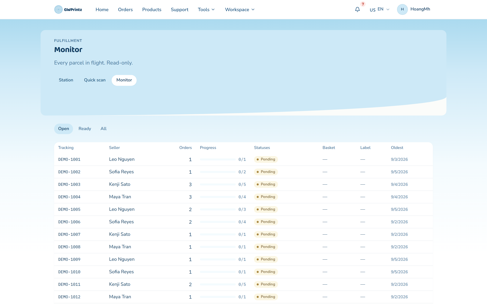

## 17. Các thao tác hàng loạt trên bảng đơn

Khi tích chọn đơn trên `/orders`, admin có thanh thao tác đầy đủ (xem ảnh mục [11](#11-nhận-đơn-về-kho-assign)):

- **Move to (n)** *(Chuyển sang)* — đổi trạng thái hàng loạt qua menu.
- **Print QR (n)** — in tem.
- **Assign (n)** — nhận đơn về kho (trừ tiền).
- **Recalculate** *(Tính lại)* — tính lại chi phí.
- **Refund** *(Hoàn tiền)* — hoàn tiền & huỷ đơn.
- **Delete** *(Xoá)*.
- **Download labels (n)** *(Tải nhãn)* — chỉ hiện khi đã cấu hình hãng vận chuyển.
- **Export (n)** *(Xuất file)* — xuất các đơn đang xem.

> Với lựa chọn gồm nhiều trạng thái khác nhau, **Move to** chỉ đưa ra các bước hợp lệ **chung** cho mọi đơn được chọn. Đơn **On hold** khi được cho chạy lại sẽ quay về đúng trạng thái trước khi bị giữ.

Tổng quan kinh doanh (doanh số, xếp hạng người bán, SKU/artwork nhiều nhất) xem ở **Analytics** *(Phân tích)* — đổi khoảng thời gian bằng dải nút ở đầu trang:

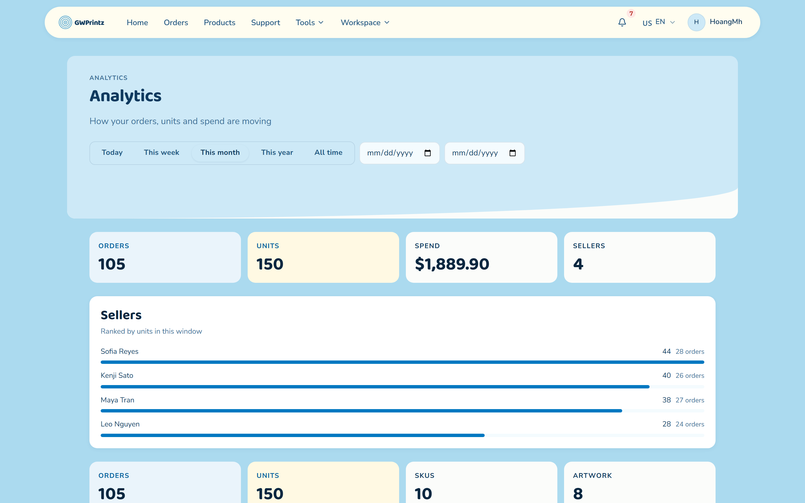

---

*Tài liệu này mô tả hệ thống ở thời điểm biên soạn. Nếu một nút hoặc nhãn khác với ảnh, giao diện có thể đã được cập nhật.*
