# Hướng dẫn người bán: Đặt đơn & theo dõi đơn hàng

> Dành cho **người bán (seller)** dùng bảng điều khiển GWPrintz để lên đơn sản xuất và theo dõi đơn tới khi giao xong.
> Ảnh chụp trong tài liệu dùng giao diện **tiếng Anh** (giao diện mặc định của hệ thống); phần chữ giải thích bằng tiếng Việt. Nếu bạn đổi ngôn ngữ sang tiếng Việt ở góc phải thanh trên cùng, các nút sẽ hiển thị đúng như phần **[trong ngoặc]** ở mỗi bước.

**Mục lục**

1. [Đăng nhập](#1-đăng-nhập)
2. [Màn hình chính (Home)](#2-màn-hình-chính-home)
3. [Xem danh mục & chọn sản phẩm](#3-xem-danh-mục--chọn-sản-phẩm)
4. [Tạo một đơn hàng](#4-tạo-một-đơn-hàng)
5. [Nhập nhiều đơn từ file CSV](#5-nhập-nhiều-đơn-từ-file-csv)
6. [Gắn thiết kế & mockup cho đơn](#6-gắn-thiết-kế--mockup-cho-đơn)
7. [Nạp tiền vào ví](#7-nạp-tiền-vào-ví)
8. [Theo dõi đơn: danh sách & bộ lọc](#8-theo-dõi-đơn-danh-sách--bộ-lọc)
9. [Xem lịch sử một đơn (timeline)](#9-xem-lịch-sử-một-đơn-timeline)
10. [Thông báo (chuông)](#10-thông-báo-chuông)
11. [Mở ticket hỗ trợ về một đơn](#11-mở-ticket-hỗ-trợ-về-một-đơn)
12. [Bảng tra cứu trạng thái đơn](#12-bảng-tra-cứu-trạng-thái-đơn)

---

## 1. Đăng nhập

Mở trang chủ. Khi chưa đăng nhập, hệ thống hiện màn hình **Welcome back** với 3 cách đăng nhập:

- **Continue with Google** — đăng nhập bằng tài khoản Google.
- **Email + mật khẩu** — nhập email và mật khẩu rồi bấm **Log In** *(Đăng nhập)*.
- **Email me a sign-in code instead** *(Gửi mã đăng nhập qua email)* — đăng nhập không cần mật khẩu, hệ thống gửi mã 6 số về email.

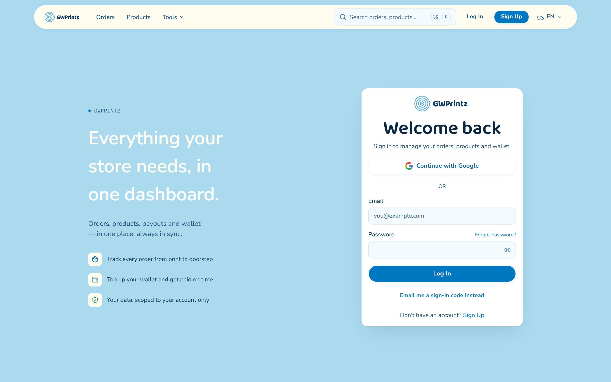

> Quên mật khẩu? Bấm **Forgot Password?** để hệ thống gửi mã đặt lại.

---

## 2. Màn hình chính (Home)

Sau khi đăng nhập, màn hình **Home** tóm tắt tình hình kinh doanh của bạn:

- **BALANCE** — số dư ví hiện tại (tiền dùng để hệ thống trừ khi xưởng nhận đơn).
- **OWED** — số tiền còn nợ.
- **ORDERS / QUANTITY** — số đơn và tổng số lượng trong kỳ đang chọn (Today / This week / This month / This year / All time).
- **Where your orders are** — biểu đồ đơn đang nằm ở trạng thái nào.
- **Recent transactions** — các giao dịch ví gần đây.

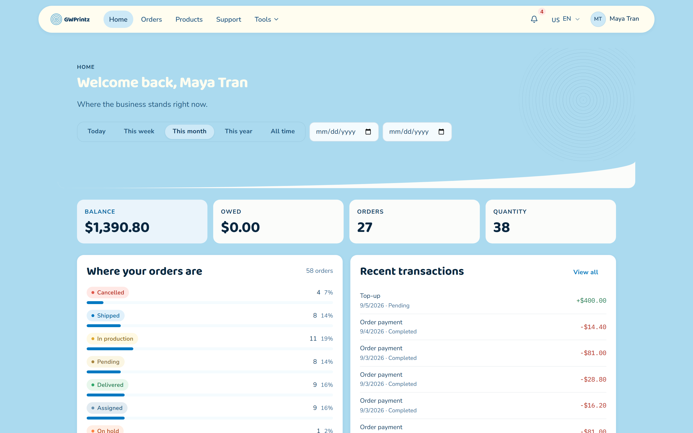

---

## 3. Xem danh mục & chọn sản phẩm

Trước khi lên đơn, hãy xem danh mục để biết **mã SKU** và **giá của bạn**.

1. Bấm **Products** *(Sản phẩm)* trên thanh menu trên cùng. Trang mở ra có tiêu đề **Catalogue** *(Danh mục)*.
2. Gõ vào ô **Search products** để lọc theo tên sản phẩm hoặc tên biến thể (lọc ngay, không tải lại trang).
3. Có thể đổi cách hiển thị bằng 2 nút **Grid / List** ở bên phải ô tìm kiếm.
4. Bấm vào thẻ sản phẩm để mở rộng, xem các tuỳ chọn và mức giá **"from $X"** *(từ $X)*.

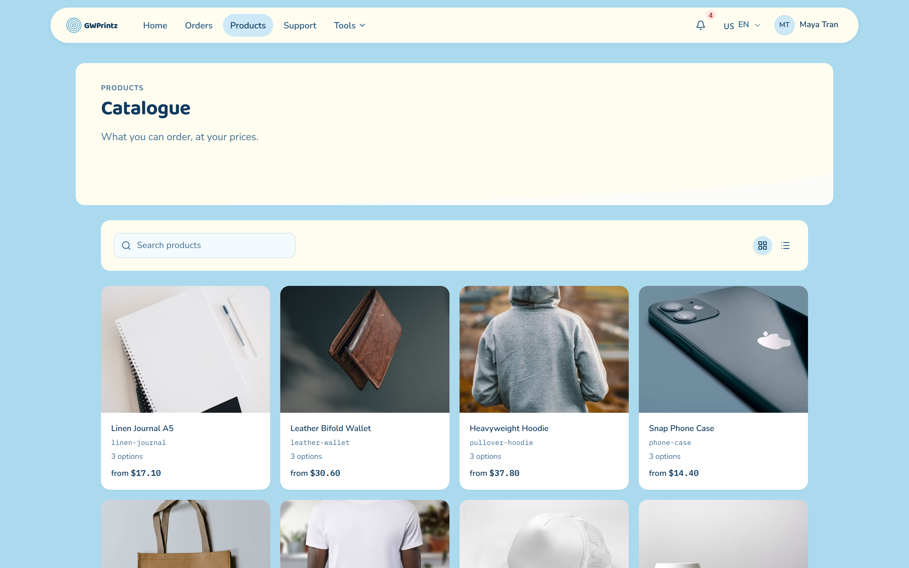

Khi mở rộng một sản phẩm, bạn thấy giá theo từng biến thể — đây là **giá riêng theo hạng (tier) của tài khoản bạn**:

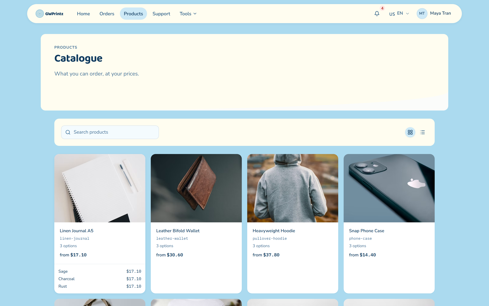

> ⚠️ **Lưu ý:** Trang danh mục chỉ để **xem** — không có nút đặt hàng ở đây. Bạn ghi nhớ tên sản phẩm và giá, rồi sang **Orders** để tạo đơn. Ở form tạo đơn, danh sách SKU hiển thị theo **tên sản phẩm + mã SKU**.

---

## 4. Tạo một đơn hàng

Mục tiêu: biến một đơn từ sàn (Etsy/Amazon/…) thành một đơn sản xuất — chọn SKU, số lượng, địa chỉ giao rồi gửi.

1. Mở **Orders** *(Đơn hàng)* trên thanh menu.
2. Bấm nút **New order** *(Đơn mới)* ở góc phải thanh công cụ của bảng.

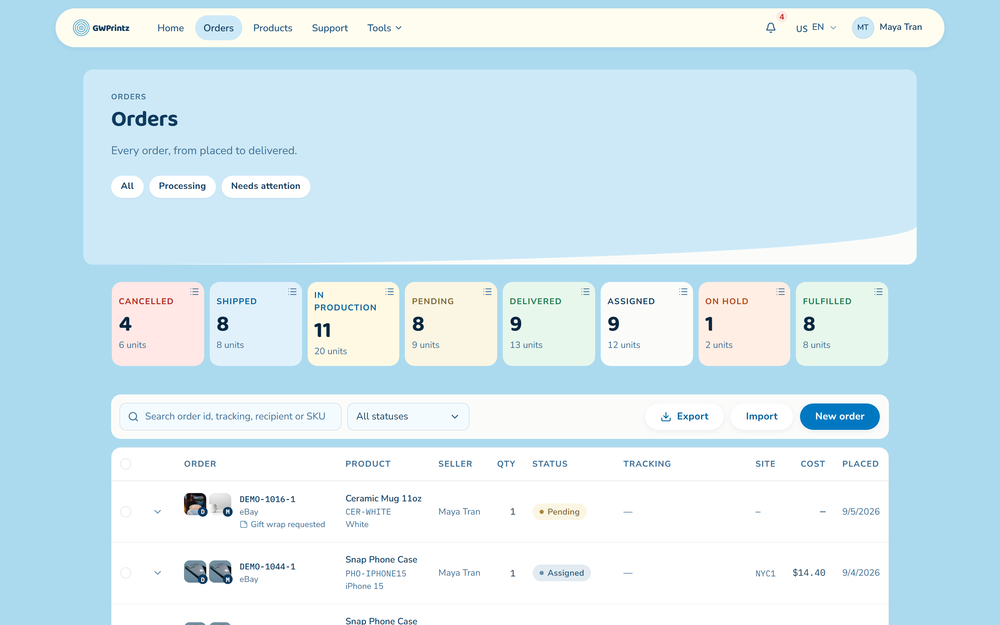

3. Điền **Order ID** *(Mã đơn)* — bắt buộc — và tuỳ chọn **Marketplace** *(Sàn)*.

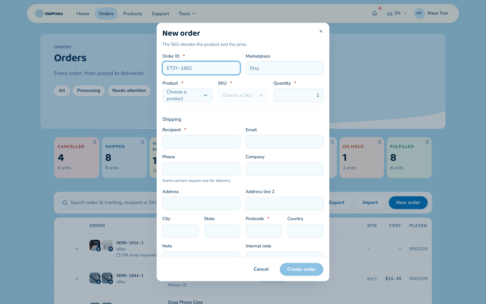

4. Mở dropdown **Product** *(Sản phẩm)* và chọn sản phẩm. Sản phẩm sẽ quyết định danh sách SKU bên cạnh.

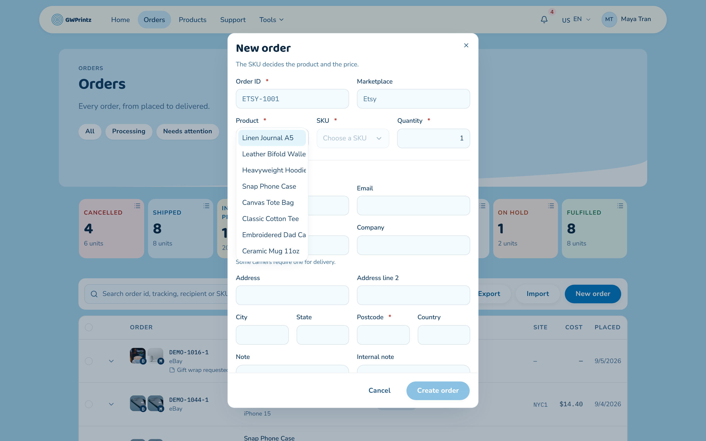

5. Mở dropdown **SKU** và chọn biến thể/SKU muốn đặt.
6. Đặt **Quantity** *(Số lượng)* — mặc định là 1.
7. Điền khối **Shipping** *(Giao hàng)*: **Recipient** *(Người nhận — bắt buộc)*, Email, Phone, Company, Address, Address line 2, City, State, **Postcode** *(Mã bưu chính — bắt buộc)*, Country.
8. Tuỳ chọn điền **Note** *(Ghi chú cho khách)* và **Internal note** *(Ghi chú nội bộ — khách không thấy)*.
9. Bấm **Create order** *(Tạo đơn)* — hoặc nhấn Enter.

> **Ý nghĩa vài trường quan trọng:**
> - **Order ID** — mã đơn của sàn; **không bắt buộc là duy nhất** (một đơn sàn có thể tách thành nhiều dòng), nhưng đây là cách bộ phận hỗ trợ tra cứu.
> - **SKU** — là thứ **duy nhất được gửi lên máy chủ**; chính SKU quyết định sản phẩm, biến thể và **giá** (tính ở máy chủ, không thể gian lận giá).
> - **Postcode** — trường địa chỉ **bắt buộc** duy nhất: "một kiện không có mã bưu chính là một ticket hỗ trợ, không phải một lô hàng".
> - **Quantity** — sẽ được tính giá và giữ tồn kho ở bước **xưởng nhận đơn (assign)**, không phải lúc tạo đơn.

---

## 5. Nhập nhiều đơn từ file CSV

Tạo hàng chục đến hàng nghìn đơn trong một lần, và xem trước dòng nào sẽ lỗi **trước khi** ghi.

1. Ở **Orders**, bấm nút **Import** *(Nhập)*.
2. Trong hộp thoại, bấm **Download template** *(Tải mẫu)* để lấy file mẫu trống.
3. Điền file mẫu bằng Excel/Google Sheets, lưu dạng CSV, rồi bấm vùng thả file lớn (nét đứt) để chọn file. Chỉ nhận **file CSV**.
4. Chờ hệ thống **tự kiểm tra SKU** khi vừa đọc file (**Checking SKUs…**).
5. Xem bảng xem trước (8 dòng đầu). Cột: **Order ID · Marketplace · SKU · Quantity · Recipient Name**.
6. Nếu có cảnh báo đỏ (*"{n} rows have no matching SKU and will be skipped"* — có dòng SKU không khớp và sẽ bị bỏ qua), sửa file rồi chọn lại; nếu không, tiếp tục.
7. Bấm **Import** để ghi.
8. Đọc màn hình kết quả: *{n} created / {n} failed* rồi bấm **Done** *(Xong)*.

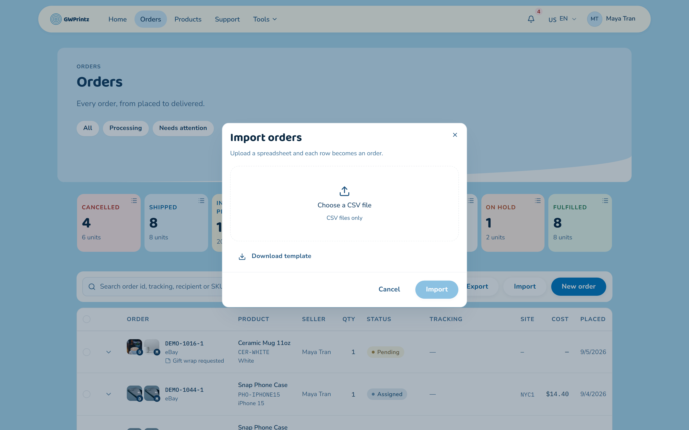

> **Cột bắt buộc trong CSV:** Order ID, SKU, Quantity, Recipient Name, Zipcode. Các cột còn lại (Marketplace, Email, Phone, Address, City, State, Country, Note, Warehouse Note, Order Date) là tuỳ chọn.
> Hệ thống gửi các dòng theo lô 50 dòng/lần.

---

## 6. Gắn thiết kế & mockup cho đơn

Để xưởng in đúng hình, gắn **file in (Design)** và **ảnh mockup** vào đơn. Chỉ làm được khi đơn còn ở trạng thái **Pending** *(Chờ xử lý)*.

1. Ở **Orders**, tìm dòng đơn **Pending** và bấm **biểu tượng ảnh** ở cột QR/thao tác (nhãn trợ năng: **Design & mockup**).
2. Với ô **Design**: dán một đường link (URL) hoặc bấm **Upload image** *(Tải ảnh lên)* để chọn file PNG/JPG/WEBP. *File tải lên sẽ được ưu tiên hơn link đã dán.*
3. Làm tương tự với ô **Mockup**.
4. Bấm **Save** *(Lưu)*.

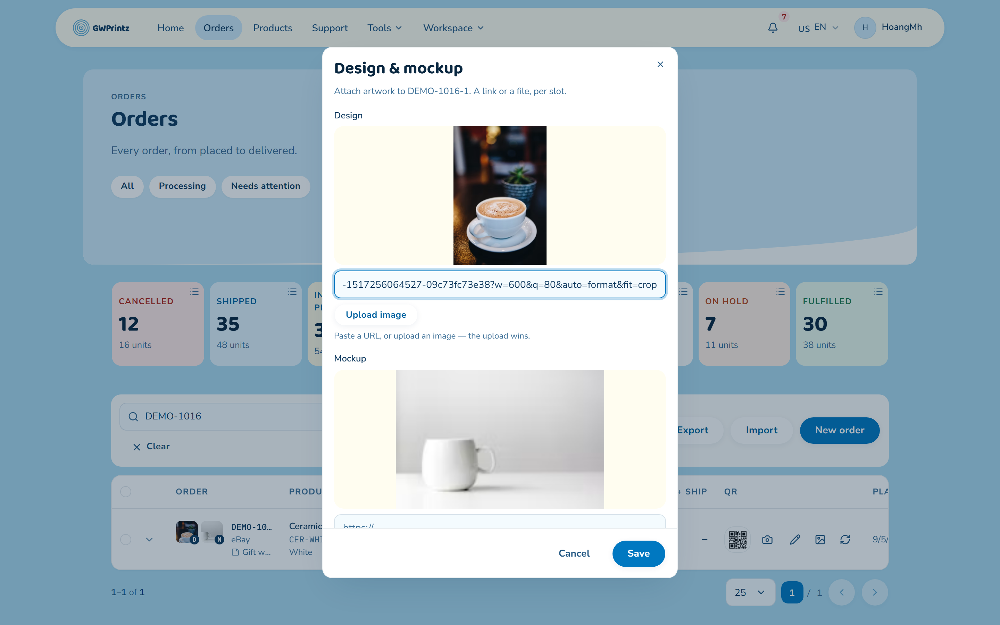

> **Design** lưu vào file in của đơn; **Mockup** là ảnh khách xem, khi lưu sẽ tạo một bản ghi mockup gắn với đơn.

---

## 7. Nạp tiền vào ví

Đơn chỉ bị trừ tiền khi **xưởng nhận đơn**, nên ví cần có đủ số dư trước đó.

Trang **Wallet** hiển thị **Available balance** *(Số dư khả dụng)*, số đơn có thể hoàn tiền, và bảng **Transactions** *(Lịch sử giao dịch)* với từng dòng nạp/trừ và số dư sau mỗi lần:

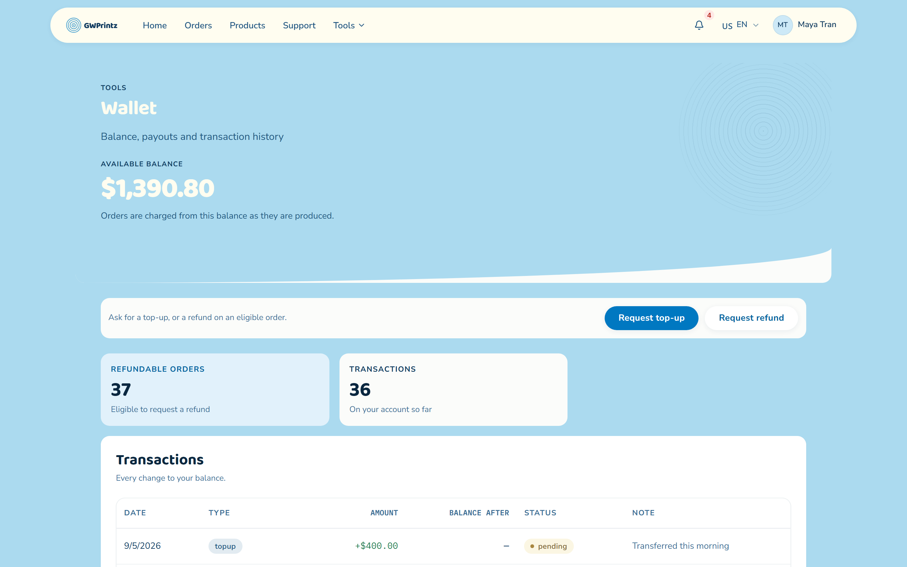

1. Mở **Wallet** *(Ví)* — trên thanh menu **Tools ▾** *(Công cụ)* → **Wallet**.
2. Bấm **Request top-up** *(Yêu cầu nạp tiền)*.
3. Nhập **Amount** *(Số tiền)*, chọn **How you paid** *(Cách thanh toán: bank transfer / card / paypal / crypto / other)*, thêm **Note** *(Ghi chú)*, và đính kèm **Evidence** *(ảnh biên lai)*.
4. Bấm **Send request** *(Gửi yêu cầu)*.

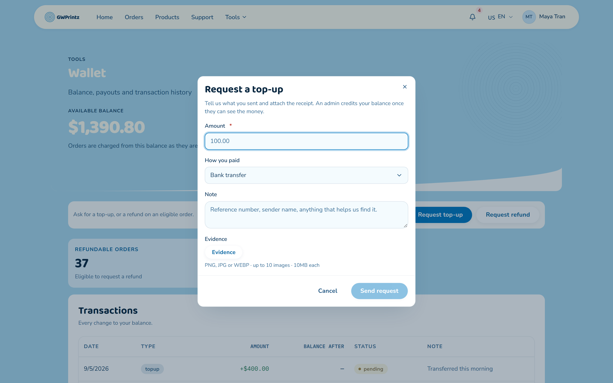

> Sau khi gửi, quản trị viên sẽ **duyệt** khi nhìn thấy tiền đến; số dư mới được cộng vào ví. Ảnh biên lai là thứ giúp người duyệt xác nhận nhanh.

---

## 8. Theo dõi đơn: danh sách & bộ lọc

### Đọc bảng đơn

Trên trang **Orders**, dải thẻ phía trên bảng cho biết mỗi trạng thái đang có bao nhiêu đơn (con số lớn) và bao nhiêu **units** *(sản phẩm)* bên dưới. Trong bảng, cột **Status** hiển thị trạng thái từng đơn.

### Lọc & tìm

- **Search** — gõ vào ô tìm kiếm: khớp theo **mã đơn, mã vận đơn, tên người nhận, hoặc SKU**.

  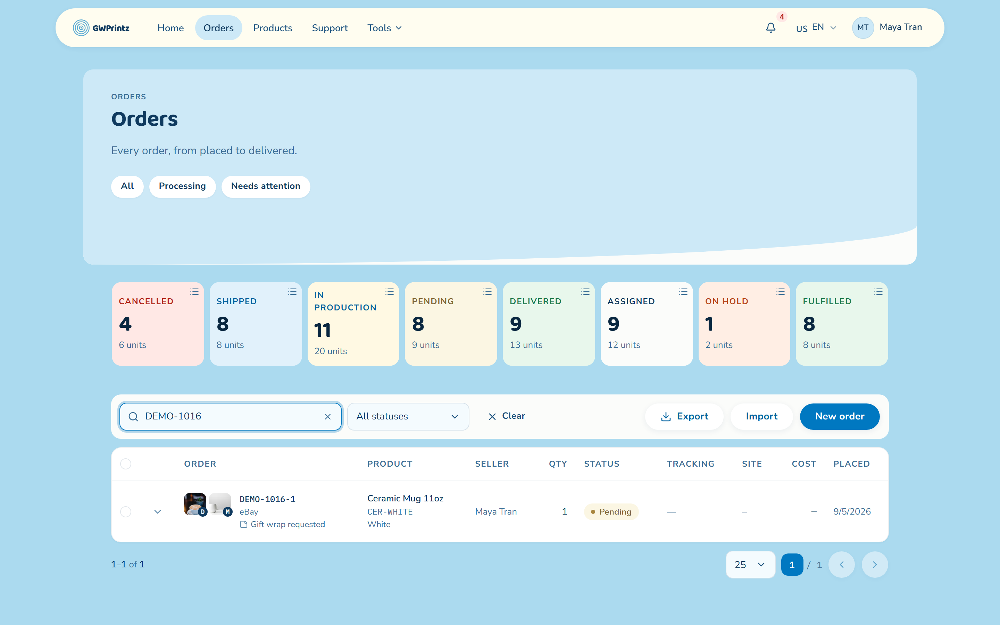

- **All statuses** *(Tất cả trạng thái)* — dropdown lọc theo một trạng thái.

  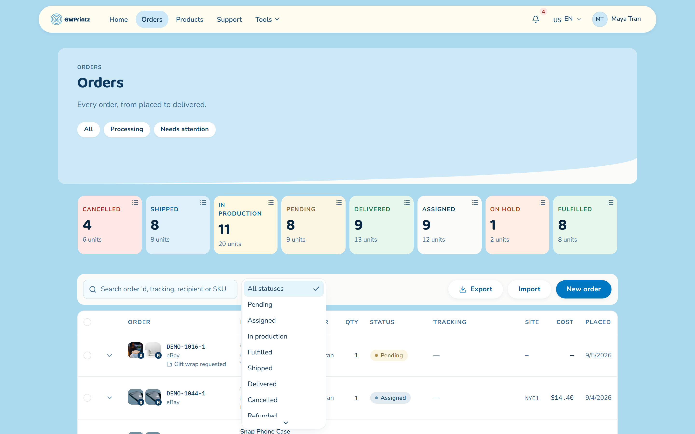

- **All / Processing / Needs attention** — 3 nhóm nhanh trong phần tiêu đề (*Tất cả / Đang xử lý / Cần chú ý*).
- Bấm một **thẻ trạng thái** trong dải để lọc theo trạng thái đó; bấm lại để bỏ lọc.
- Bấm **Clear** *(Xoá lọc)* để trở về danh sách đầy đủ.

---

## 9. Xem lịch sử một đơn (timeline)

1. Bấm **mũi tên (chevron)** ở cột hẹp bên trái dòng (ngay sau ô chọn). Nhãn trợ năng: **Show order timeline**.
2. Đọc dải cột mốc: **Pending → In production → Fulfilled → Shipped → Delivered** *(Chờ → Đang sản xuất → Đã hoàn thành → Đã gửi → Đã giao)*.
3. Đọc **ngày** dưới mỗi mốc (dấu "—" nghĩa là chưa tới mốc đó).
4. Bấm mũi tên lần nữa để thu gọn.

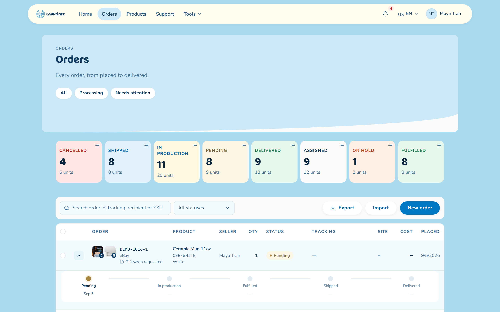

### Xem chi tiết đầy đủ một đơn

Đây là **màn hình chi tiết đơn duy nhất** — một hộp thoại, không phải một trang riêng.

1. Ở cột **Order**, bấm **ảnh thu nhỏ 32px gắn nhãn M** (mockup của khách).
2. Đọc phần mã bên trái; đổi định dạng bằng các nút **QR · Barcode · Image**.
3. Đọc danh sách thông tin bên phải: **Order · Status · Product · Variant · Qty · Site · Tracking · Ship to · Placed · Note**.
4. Nếu kiện đã có ảnh chụp đóng gói (proof photo), bấm ảnh viền xanh ở góc dưới phải để mở ảnh lớn.

> **Về mã vận đơn (Tracking):** đọc ở cột **Tracking** trên dòng, hoặc ở dòng Tracking trong hộp thoại chi tiết. Chọn số và tự sao chép để dán vào website của hãng vận chuyển.

---

## 10. Thông báo (chuông)

1. Bấm **biểu tượng chuông** trên thanh trên cùng. Chấm đỏ là số thông báo chưa đọc ("9+" nếu hơn 9).
2. Lọc theo các tab **All · Orders · Warehouse · Payments · System**, hoặc bật **Unread Only** *(Chỉ chưa đọc)*.
3. Bấm một dòng thông báo để mở (ví dụ *"Order … is now Shipped"*, *"Label ready for order …"*, *"2 orders sent to production"*).
4. Tuỳ chọn: bấm **Mark All Read** *(Đánh dấu đã đọc hết)* hoặc **View All Notifications** *(Xem tất cả)* ở cuối bảng.

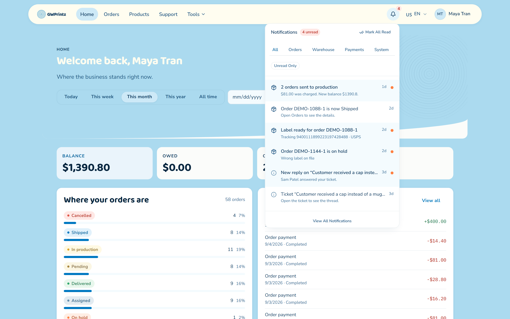

> Thông báo về **ticket** (ví dụ "New reply on …") nằm trong tab **System**.

Trang lưu trữ đầy đủ tại **/notifications** — nơi phân trang, lọc theo tab và **xoá** thông báo (di chuột vào dòng → nút thùng rác → nút đỏ **Delete**):

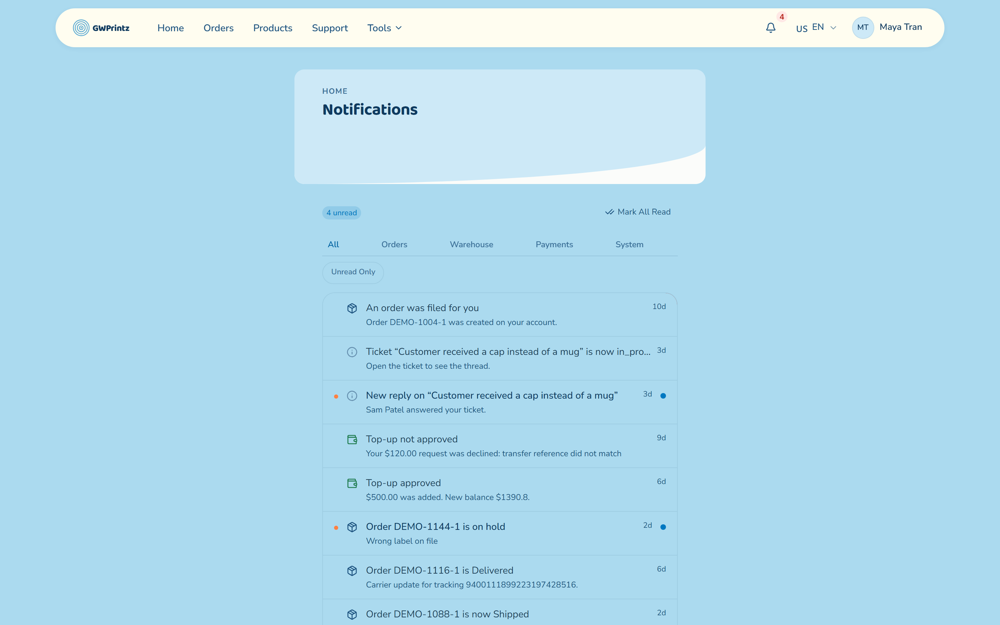

---

## 11. Mở ticket hỗ trợ về một đơn

Báo lỗi về một đơn cụ thể (sai hàng, chất lượng, nhãn, địa chỉ, thiếu hàng) kèm ảnh bằng chứng.

1. Bấm **Support** *(Hỗ trợ)* trên thanh menu.
2. Bấm **New ticket** *(Ticket mới)* ở góc phải thanh công cụ.

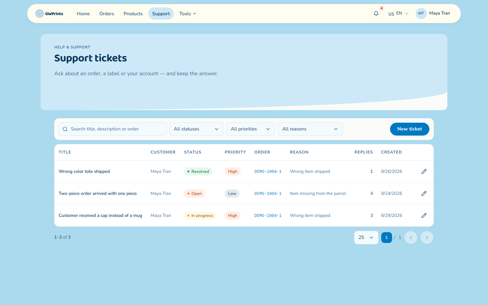

3. Điền **Title** *(Tiêu đề)* — trường bắt buộc duy nhất.
4. Chọn **Reason** *(Lý do)*: *Wrong item shipped / Quality problem or return / Label problem / Wrong address / Item missing / Something else*. Đổi Reason sẽ **tự đổi Priority** theo mức gợi ý.
5. Chỉnh **Priority** *(Độ ưu tiên: Low / Medium / High / Urgent)* nếu cần.
6. Chọn **Order** *(Đơn liên quan)* — hoặc "Not about a specific order".

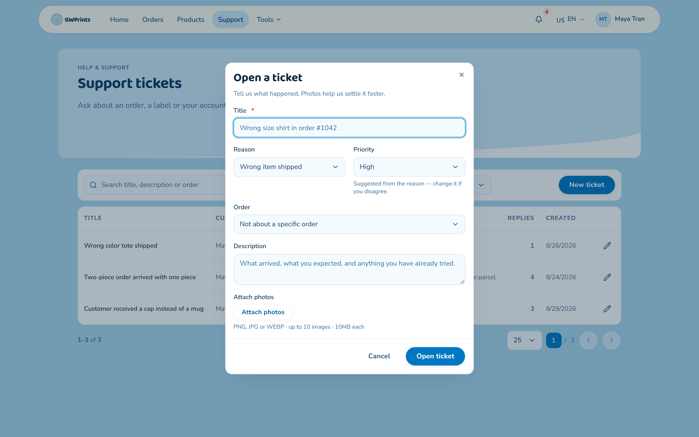

7. Bấm gửi. Trong trang chi tiết ticket, bạn theo dõi hội thoại và **trả lời** ở ô **Write a reply** *(Viết trả lời)*, đính kèm ảnh, rồi bấm **Send** *(Gửi)*.

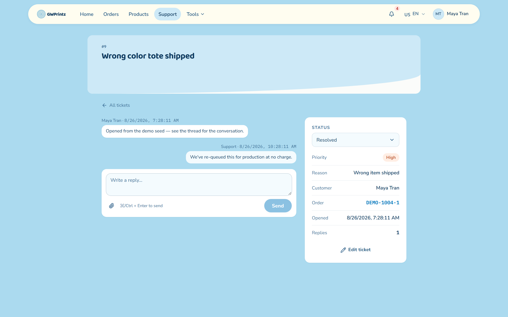

---

## 12. Bảng tra cứu trạng thái đơn

Đơn đi qua các trạng thái sau. Bạn (người bán) không tự đẩy trạng thái sản xuất — xưởng làm việc đó — nhưng hiểu ý nghĩa giúp bạn đọc đúng tình hình.

| Trạng thái | Nhãn giao diện | Ý nghĩa |
|---|---|---|
| PENDING | **Pending** — Chờ xử lý | Đơn vừa tạo, chưa ai bị trừ tiền, chưa định tuyến. **Chỉ ở trạng thái này** mới sửa được số lượng và thiết kế. |
| ASSIGNED | **Assigned** — Đã giao xưởng | Đã định tuyến về một kho **và** người bán đã bị trừ tiền, tồn kho được giữ. |
| IN_PRODUCTION | **In production** — Đang sản xuất | Đang được làm. Bắt đầu khi xưởng **quét (scan)** kiện tại trạm. |
| FULFILLED | **Fulfilled** — Đã hoàn thành | Đã làm xong và đóng gói; đánh dấu bằng **ảnh chụp đóng gói** (proof photo). |
| SHIPPED | **Shipped** — Đã gửi | Đã bàn giao cho hãng vận chuyển; luôn có bản ghi vận đơn và mã tracking. |
| DELIVERED | **Delivered** — Đã giao | Trạng thái **kết thúc**. Chỉ do người thao tác chọn — hệ thống tracking của hãng vận chuyển không tự đổi trạng thái này. |
| ON_HOLD | **On hold** — Tạm giữ | Bị giữ lại (ví dụ sai nhãn). Có thể quay lại đúng vị trí cũ trong hàng đợi. Nằm trong nhóm **Needs attention**. |
| CANCELLED | **Cancelled** — Đã huỷ | Trạng thái kết thúc. Có thể huỷ từ bất kỳ trạng thái đang chạy nào; hoàn tiền cũng đưa đơn về Cancelled. |
| REFUNDED | **Refunded** — Đã hoàn tiền | Chỉ dùng cho dữ liệu cũ chuyển sang; đơn mới **không** rơi vào trạng thái này. |

---

*Tài liệu này mô tả hệ thống ở thời điểm biên soạn. Nếu một nút hoặc nhãn khác với ảnh, giao diện có thể đã được cập nhật — hãy báo cho quản trị viên.*
